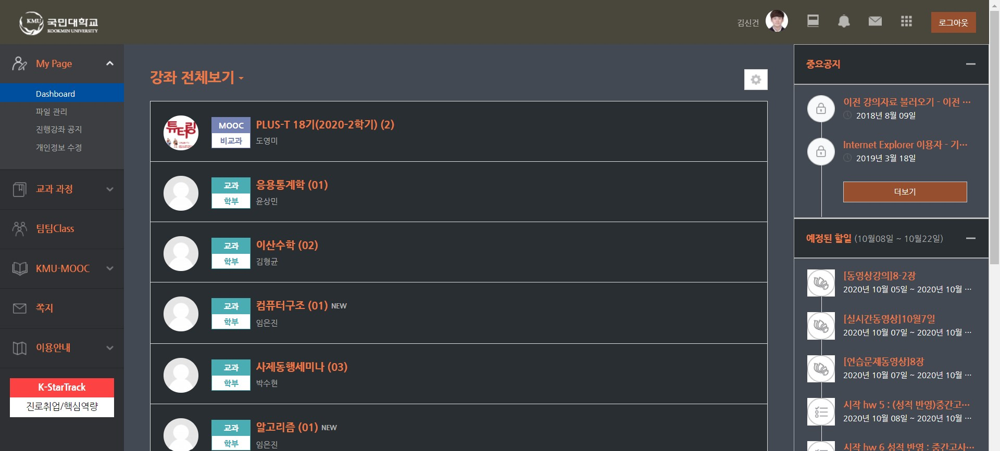

# kmu-ecampus-darkmode-extension
국민대학교 가상대학 다크모드 크롬 확장 프로그램입니다. 현재, 개발 진행 중입니다.

## Usage
- `chrome://extensions` 링크에서 우측 상단에 있는 개발자 모드를 활성화합니다.
- `git clone https://github.com/shinkeonkim/kmu-ecampus-darkmode-extension.git`
- `압축해제된 확장 프로그램을 로드합니다`버튼을 누른 뒤, clone한 레포 폴더를 지정합니다.